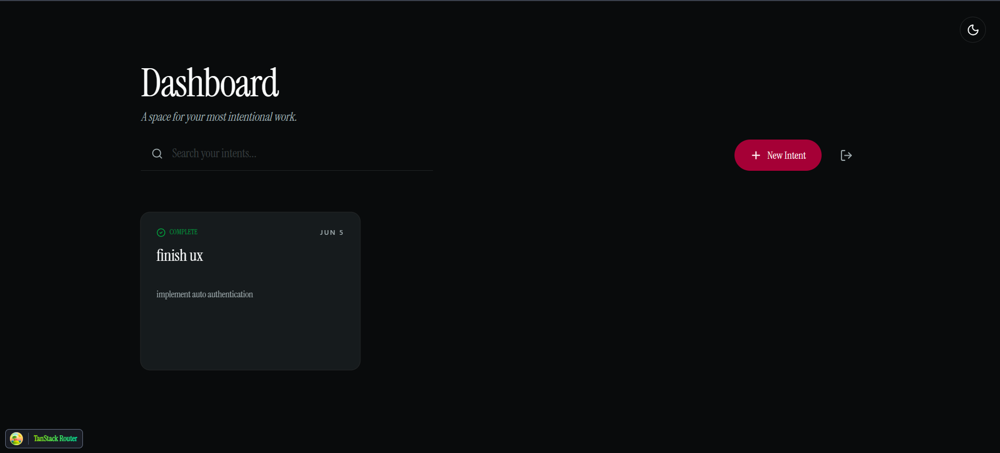
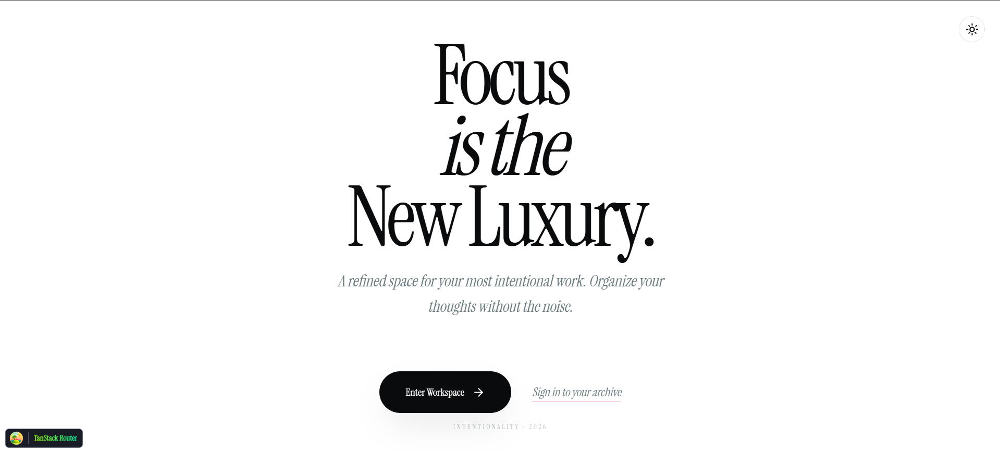
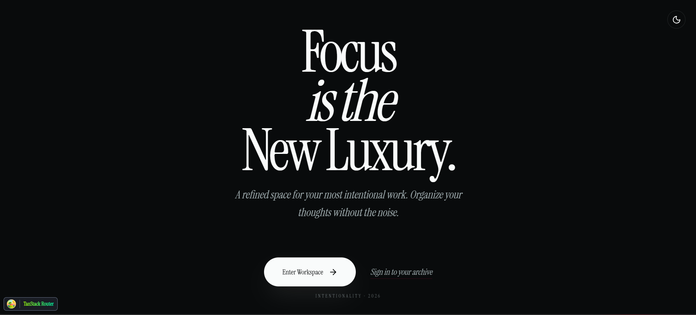

# Intentional Task Management

A focused, editorial-grade task management experience designed for individuals who value clarity, typography, and a deliberate pace in their productivity tools.



## Overview

This project is a refined task management application that prioritizes visual calm and focus. It provides an "Academic" and "Intentional" interface for organizing life and work, moving away from the high-density, noisy layouts of traditional SaaS dashboards.

### What it does
- **Captures Intent**: Move beyond simple "tasks" to recording "intents" with depth and context.
- **Visual Focus**: High-contrast, typographic-first design using serif headings for a readable, calm experience.
- **Atmospheric Themes**: Support for light and dark modes with smooth, intentional transitions.
- **User Privacy**: Secure authentication to keep your thoughts and intents private.

### How it works
The application uses a modern full-stack architecture:
- **Frontend**: A React (Vite) application using TanStack Router for type-safe routing and TanStack Query for efficient data fetching.
- **Backend**: A Node.js Express server providing a RESTful API.
- **Styling**: Tailwind CSS 4 with OKLCH color spaces and Shadcn/UI components for a premium feel.
- **Database**: MongoDB (via Mongoose) for flexible task and user data storage.

## Folder Structure

```text
task-management/
├── backend/                # Express.js Server
│   ├── src/
│   │   ├── controllers/    # Request handlers
│   │   ├── models/         # Database schemas (User, Task)
│   │   ├── routers/        # API route definitions
│   │   ├── middlewares/    # Auth and validation logic
│   │   ├── utils/          # Database connection
│   │   └── validations/    # Zod/Schema validation
│   └── .env                # Server configuration
├── frontend/               # Vite + React Client
│   ├── src/
│   │   ├── components/     # UI Components (ModeToggle, TaskForm)
│   │   ├── hooks/          # Custom hooks (useAuth, useTask)
│   │   ├── lib/            # Shared utilities (axios, queryClient)
│   │   ├── routes/         # TanStack Router page definitions
│   │   └── index.css       # Tailwind 4 global styles
│   └── public/             # Static assets and screenshots
├── DESIGN.md               # Visual identity and design system
└── PRODUCT.md              # Product purpose and brand personality
```

## Features

- **Editorial UI**: Minimalist design centered around `Instrument Serif` typography.
- **Dark/Light Mode**: Integrated theme toggle with persistent user preference.
- **Full CRUD**: Create, read, update, and delete tasks (intents).
- **Search & Pagination**: Efficiently explore your history of thoughts.
- **Mobile Responsive**: Refined layout that adapts from desktop to mobile.
- **Secure Auth**: JWT-based authentication for secure access.

| Light Mode | Dark Mode |
| :--- | :--- |
|  |  |

## Getting Started

### Prerequisites
- Node.js (v18+)
- MongoDB (Local or Atlas)

### Setup

1. **Clone the repository**
   ```bash
   git clone <repository-url>
   cd task-management
   ```

2. **Backend Setup**
   ```bash
   cd backend
   npm install
   # Create a .env file based on existing .env
   # Ensure PORT, MONGODB_URI, and JWT_SECRET are set
   npm start
   ```

3. **Frontend Setup**
   ```bash
   cd ../frontend
   npm install
   npm run dev
   ```

4. **Access the application**
   Open `http://localhost:5173` in your browser.

## Future Roadmap

- [ ] **Prioritization Matrix**: Categorize intents based on impact vs. effort.
- [ ] **Rich Text Support**: Allow for more detailed context within task descriptions.
- [ ] **Offline Mode**: Local-first sync using TanStack Query's persistent cache.
- [ ] **Export Feature**: Download your intentional history as a beautifully typeset PDF.
- [ ] **Focus Timer**: Integrated pomodoro-style timer to work on specific intents.

---
*Created with focus and intent.*
